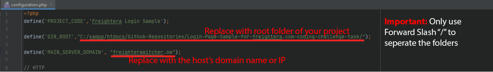

# Login Form with Backend - Coding Challenge #
 A simple login form with backend.
 
 ## Technical Details ##
* Languages of code: 
    * Backend: 
        * PHP 7.4
        * MySQL
    * Frontend:
        * JavaSript
        * HTML
        * CSS

* PHP Framework: [Witcher 2.0](https://github.com/iliaamiri/WitcherPhpFramework "Github Repo")
 
# For setup, please follow the steps below:

1. Open the file `configuration.php` in /public_html/
2. Replace the first full path `C:/xampp/htdocs/Github-Repositories/Login-Page-Sample-for-freightera.com-coding-challenge-task/` with your own full path of this project's root folder, in other words, the folder where /witcher and /public_html are located.
3. Replace the domain name of your host. If you don't have any domain name, you may enter the IP address of your server too.

5. Save the file. And you are done!
 

