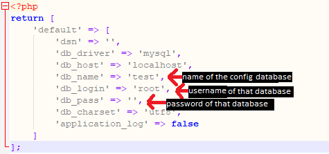

# To setup the databases, follow each steps for both setups: #

## Setup for MySQL (using the GUI of phpMyAdmin): ##
1. Create two MySQL databases with a prefix name, (for example: witcher_config and withcer_main, the prefix name in here is "witcher").

2. Import both .sql files, knowing that test.sql is the config database and test_main is the main database. (When uploading finished, click the "Go" button on the bottom right).

3. Navigate through the test.sql > main_database table and update the 'db_name' column from 'test_main' to the name of the other database (main database - test_main.sql). 
NOTE: If your username and password for the main database is different, in the same table, update the "db_user" and "db_pass" from default to whatever username or password your main database has.

4. And you are done!

The end result of databases would look very similar as the figure below (Except, the names of the databases can be different then mine):

## Setup for the source code: ##
1. Navigate through witcher/core/config/ and edit the database.php file.
2. Update the first database name (the database you were just editting), username of this database, and its password.

4. Save the file and close it. And you are done!
